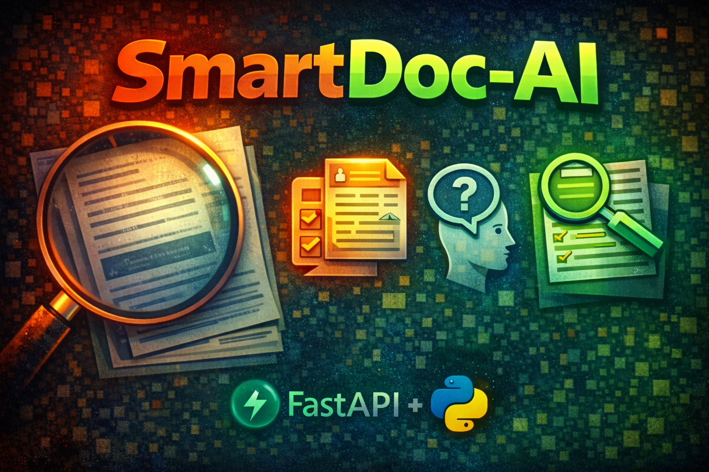

---

# SmartDoc AI - Intelligent OCR Document Processing

SmartDoc AI is an automated document processing system for small businesses. It extracts structured data (Date, Total, Items) from receipts and invoices using OCR and modern preprocessing.

## Features
- **Upload Image/PDF**: Supports common receipt and invoice formats.
- **Modern Interface**: Professional glassmorphism design with smooth transitions.
- **Automated Parsing**: Extracts Date, Total Amount, and individual Line Items.
- **Image Preprocessing**: Built-in grayscale and thresholding to handle noisy or low-quality documents.
- **Data Export**: One-click export to CSV and Microsoft Excel formats.

## Setup Instructions

### 1. Install Tesseract OCR (Windows)
Download and install [Tesseract-OCR for Windows](https://github.com/UB-Mannheim/tesseract/wiki).
The application is pre-configured to automatically detect common Tesseract installation paths on Windows.

### 2. Install Python Dependencies
```bash
pip install -r requirements.txt
```

### 3. Start the Server
```bash
python main.py
```
Open your browser at `http://localhost:8000`.

## Project Structure
- `/api`: FastAPI route handlers and request processing.
- `/ocr`: Text extraction and image cleaning logic.
- `/parser`: Data transformation logic for mapping text to structured JSON.
- `/static`: Frontend application assets.
- `main.py`: Main entry point and server configuration.

## Technological Stack
- **Backend**: Python, FastAPI, Uvicorn, Pydantic, Pandas.
- **OCR Engine**: Pytesseract / Tesseract.
- **Image Processing**: OpenCV (cv2).
- **Frontend**: HTML5, Vanilla CSS, Lucide Icons.

## Credits
Designed and Developed by **Au Amores**.

## License
This project is licensed under the Apache License 2.0. See the `LICENSE` file for details.
